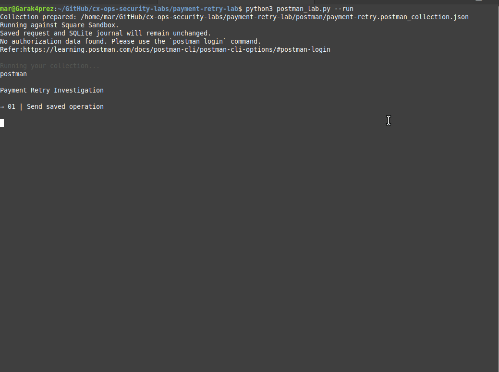
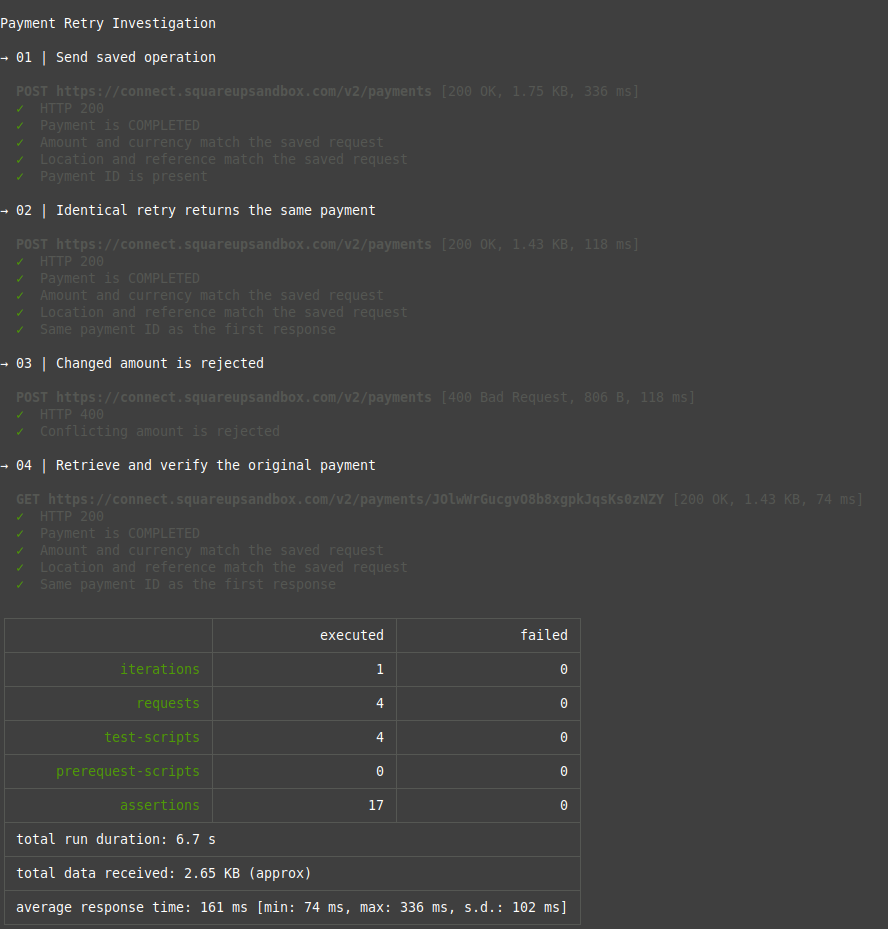

# Demonstrating Payment Idempotency with Square Sandbox

A hands-on demonstration of how an idempotency key lets repeated payment
requests refer to the same operation.

**If a payment response goes missing, can you retry without charging twice?**

This lab explores that question using simulated payments in Square Sandbox.
It sends requests, repeats them with the same idempotency key, and records
the responses in a local SQLite journal.

> **A request attempt is not a payment.** Multiple attempts can refer to
> one payment operation.

I built this project to better understand how idempotent REST APIs behave.
I used ChatGPT to help write the Python, SQLite, and Postman integration
code. All payments are simulated.

## ▶ See it run

The demonstration submits a saved payment request, retries it unchanged,
tries a conflicting amount, and retrieves the original payment.

**The HTTP 400 is expected:** Square rejects the changed amount because
the request reuses the original idempotency key.

View the terminal screenshot

**Run it yourself:** follow the [runbook](RUNBOOK.md).

## How the lab works

An **idempotency key** identifies an operation across repeated requests.
The lab saves that key and the payment parameters before sending anything,
then reuses them when retrying the operation.

| Component | Role |
|---|---|
| Square Sandbox | Processes simulated payments and implements payment-side idempotency |
| Postman CLI | Runs the API request sequence and checks the responses |
| Python helpers | Prepare the collection, save captures, and import evidence |
| SQLite journal | Associates recorded payment-submission attempts with an operation |

Postman was added to simplify repeat runs and provide a starting point for
future projects. It reproduces the behavior first investigated with the
Python scripts.

## 📋 What the Postman run checks

For the saved $10 request:

| Step | Expected result |
|---|---|
| Send the saved operation | HTTP 200 and a completed $10 payment |
| Retry with the same key and parameters | HTTP 200 and the same payment ID |
| Change the amount to $11, keeping the key | HTTP 400 with `IDEMPOTENCY_KEY_REUSED` |
| Retrieve the original payment | The same completed payment with its original details |

The verified run passed **17 assertions across four requests**.

The first request can replay an existing payment. A successful run does
not necessarily create a new payment.

### What gets recorded

The verified evidence integration added **three POST attempts** to SQLite:
two $10 requests returning the same payment ID, and the rejected $11 request.

The GET response is saved separately as supporting evidence. It does not
count as another payment-submission attempt.

Each new run records new attempts. Reimporting an unchanged named capture
does not duplicate its database row. Earlier Postman runs made before the
evidence integration are not included in the journal.

## 🔎 Findings from the original investigation

The original Python workflow also explored missing local responses,
concurrent requests, and independent payment listing.

| Scenario | Observed result |
|---|---|
| Initial $10 payment | HTTP 200, `COMPLETED` |
| Identical sequential retry | HTTP 200, same payment ID |
| Same key, amount changed to $11 | HTTP 400, `IDEMPOTENCY_KEY_REUSED` |
| Successful response body deliberately discarded, then request retried | Completed payment details recovered |
| Two synchronized client requests with the same key and parameters | Both HTTP 200, same completed payment ID |

An independent paginated listing returned one distinct payment for each
reference: `retry-lab-001`, `retry-lab-002`, and `retry-lab-003`, within the
saved query's location and time window.

### What this means for an investigation

- Persist the operation's key and parameters before sending a payment.
- If the outcome is unknown, retry that operation with the same key and
  parameters, subject to the provider's idempotency retention policy.
- Investigate parameter conflicts. Automatically substituting a new key
  can create another payment instead of recovering the original one.
- Follow every pagination cursor before drawing conclusions from a
  payment list. This lab counts distinct payment IDs.
- Check both API results and evidence-import results. Passing assertions
  alone does not establish that the journal was updated.

### Historical journal snapshot

These counts describe the original investigation before the Postman
integration. Subsequent journaled runs add attempts.

| Operation reference | Recorded attempts | Distinct payment IDs observed |
|---|---:|---:|
| retry-lab-001 | 4 | 1 |
| retry-lab-002 | 1 | 1 |
| retry-lab-003 | 2 | 1 |

The fourth attempt for `retry-lab-001` is a later replay through the
reusable Python sender. The deliberately discarded response is not
included in the journal.

## Scope and limitations

- Square implements idempotency. This lab investigates observed behavior;
  it does not implement payment-side duplicate prevention.
- Discarding a successful response body simulates missing local evidence,
  not an actual network timeout.
- Synchronized client threads do not prove overlapping execution inside
  Square.
- Retrieving one payment confirms its details, not the absence of other
  payments. Listing findings apply only to the query's location and time
  window, and listings can lag recent changes.
- Repeated use of a key does not establish indefinite duplicate prevention.
- The Postman collection covers sequential retry, parameter conflict, and
  retrieval. It does not repeat the concurrency or independent listing
  experiments.
- The original conflict and discarded-response captures were prepared
  manually and are excluded from Git. Postman now provides a repeatable
  conflict check; it does not recreate the discarded-response experiment.

### Evidence handling

Local evidence stays under `data/`, which is excluded from Git.
Postman captures retain request bodies, response bodies, and selected
metadata, without request authorization headers.

The full Postman report and token environment file are temporary and
removed on normal exit. An interruption before export can leave an
evidence gap; the journal is not a complete network audit trail.

`import_capture.py` compares the parsed fields it stores and rejects
changes to an already imported capture. The legacy `import_evidence.py`
and `import_concurrency.py` importers skip existing evidence names without
comparing their contents.

The concurrency importer requires two captured HTTP responses. It does
not import transport-error-only attempts.

## Files

| File or directory | Purpose |
|---|---|
| `RUNBOOK.md` | Setup, execution, evidence inspection, and troubleshooting |
| `setup_lab.py` | Initializes SQLite and creates or preserves the saved request |
| `postman_lab.py` | Generates and runs the Postman collection |
| `postman_evidence.py` | Saves Postman captures and imports POST attempts |
| `postman/payment-retry.postman_collection.json` | Generated collection and response assertions |
| `send_payment.py` | Sends a saved request and captures its response |
| `import_capture.py` | Imports a capture and checks changed reimports |
| `test_import_capture.py` | Five offline importer tests |
| `schema.sql` | Operation and attempt tables |
| `list_payments.py` | Paginated listing and distinct-payment counts |
| `concurrent_retry.py` | Sends a persisted request from synchronized threads |
| `import_concurrency.py` | Imports the two captured concurrency responses |
| `import_evidence.py` | Imports the original manually prepared evidence |
| `docs/assets/` | Terminal GIF and screenshot |
| `data/` | Local requests, responses, metadata, and SQLite database; ignored by Git |

Python helpers use the standard library. A Python virtual environment is
optional. Postman CLI is installed separately.

## Validation

- Original fresh-clone setup and five offline importer tests passed.
- Postman CLI version `1.59.0` passed all 17 API assertions.
- A direct SQLite query confirmed the three imported POST attempts,
  their submitted amounts, matching successful payment IDs, and conflict code.

## References

- [Square idempotency patterns](https://developer.squareup.com/docs/build-basics/common-api-patterns/idempotency)
- [Square List Payments API](https://developer.squareup.com/reference/square/payments-api/list-payments)
- [Square Sandbox payments](https://developer.squareup.com/docs/devtools/sandbox/payments)
- [Idempotence explained](https://www.freecodecamp.org/news/idempotence-explained)
- [Idempotent REST APIs](https://restfulapi.net/idempotent-rest-apis/)

- [Postman CLI collection commands](https://learning.postman.com/docs/postman-cli/postman-cli-collections/) — collection execution, environment files, timeouts, and reporting options.
- [Postman CLI reporters](https://learning.postman.com/docs/postman-cli/postman-cli-reporters/) — JSON report export used by the evidence adapter.
- [Postman test assertions](https://learning.postman.com/docs/tests-and-scripts/write-scripts/postman-sandbox-reference/pm-test-expect/) — `pm.test` and `pm.expect` checks used in the collection.

- [Create Payment](https://developer.squareup.com/reference/square/payments-api/create-payment) — payment request fields, idempotency keys, and responses.
- [Get Payment](https://developer.squareup.com/reference/square/payments-api/get-payment) — retrieving a payment by ID.
- [Access tokens and credentials](https://developer.squareup.com/docs/build-basics/access-tokens) — obtaining and using the Sandbox access token.

- [Peek](https://github.com/phw/peek) — screen recorder used for the terminal GIF.
